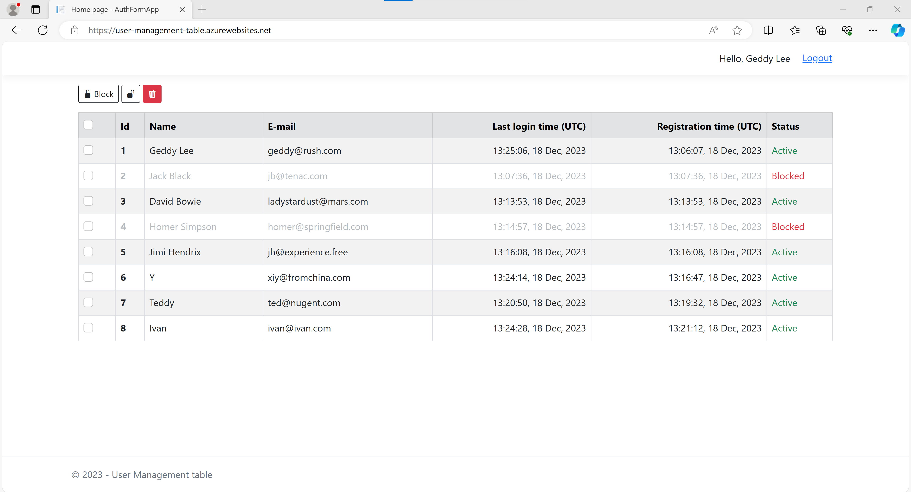
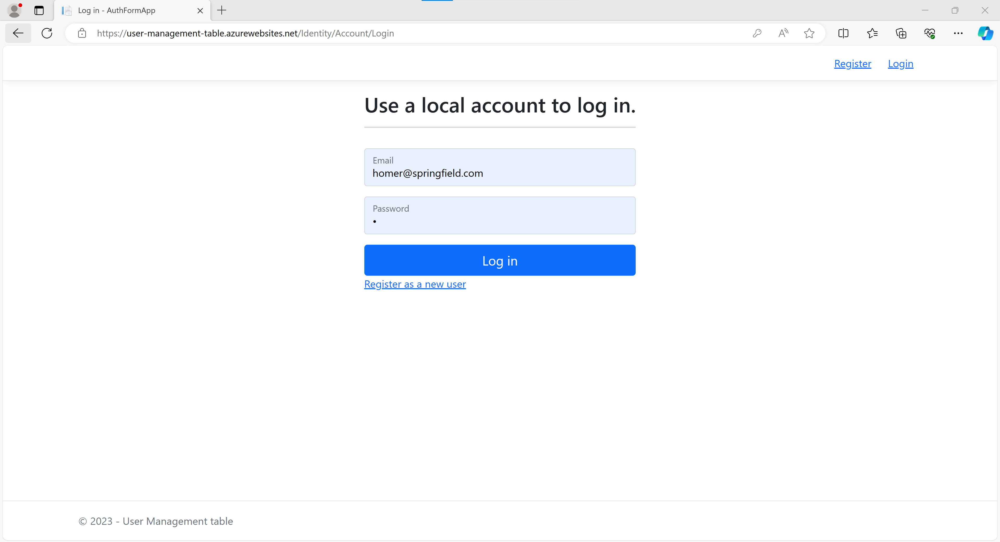

# AuthFormApp

  

User Management Table Web App provides authentication and authorization of users.\
The app provides a table of users with Block / Unblock and Delete button.

A user can observe a table with users and their data including name, email,registration\
date and time, last login date and time, and current status.

>Check out the <a href="https://youtu.be/D7U3Rk6JGLY"><u><i>Demo Video</a>!</i></u>

The Web app base on ASP.NET Razor Pages, uses EF Core and SQLite database as\
identity data storage for ASP.NET authentication and authorization mechanism.

>You can play with the deployed test version on:\
<a href="https://user-management-table.azurewebsites.net/">
<u><i>user-management-table.azurewebsites.net</i></u>
</a>

---

  
<i>UI Screenshots</i>

